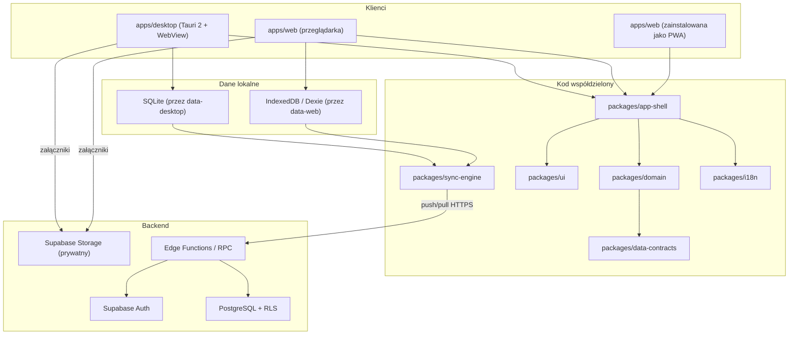

# Architektura

> **Status: szkic wstępny (Kamień 0).** Diagramy i szczegóły komponentów zostaną uzupełnione w Kamieniach 1-2, gdy powstaną wspólny shell, warstwa danych i synchronizacja. Ten dokument nie jest jeszcze kompletny — traktuj go jako mapę drogową, nie jako opis gotowego systemu.

## 1. Przegląd produktu

Jeden produkt, trzy powierzchnie dostępu, wspólna domena:

## 2. Warstwy kodu (planowane, patrz `docs/specyfikacja-produktu.md` §5.2)

| Pakiet                    | Odpowiedzialność                                                    | Zależy od                    |
| ------------------------- | ------------------------------------------------------------------- | ---------------------------- |
| `packages/domain`         | Encje, use-case'y, obliczenia (P&L, RR, drawdown), reguły walidacji | `data-contracts`             |
| `packages/data-contracts` | Schematy Zod, typy współdzielone, metadane synchronizacji           | —                            |
| `packages/ui`             | Design system, komponenty prezentacyjne                             | — (bez zależności od domain) |
| `packages/i18n`           | Polskie komunikaty, test kompletności/mojibake                      | —                            |
| `packages/data-desktop`   | Adapter SQLite przez komendy Rust                                   | `data-contracts`             |
| `packages/data-web`       | Adapter IndexedDB/Dexie                                             | `data-contracts`             |
| `packages/sync-engine`    | Outbox, pull/push, konflikty, retry                                 | `data-contracts`             |
| `packages/app-shell`      | Wspólny routing i layout React                                      | `domain`, `ui`, `i18n`       |
| `packages/testing`        | Fabryki danych wyłącznie do testów                                  | —                            |

Zasada graniczna: `domain` nie zależy od żadnego frameworka UI ani od konkretnego adaptera danych (SQLite/IndexedDB/PostgreSQL) — te wstrzykiwane są przez porty/adaptery.

## 3. Do uzupełnienia w kolejnych kamieniach

- Kamień 1: diagram routingu i stanów aplikacji (loading/empty/error/offline).
- Kamień 2: pełny diagram sekwencji synchronizacji (outbox → push → pull → rozwiązanie konfliktu), schemat bazy PostgreSQL i SQLite.
- Kamień 3: diagram modelu domenowego transakcji (nogi wejścia/wyjścia, checklisty, snapshoty strategii).
- Kamień 6: diagram procesu aktualizacji (manifest → pobranie → weryfikacja podpisu → backup → instalacja).
